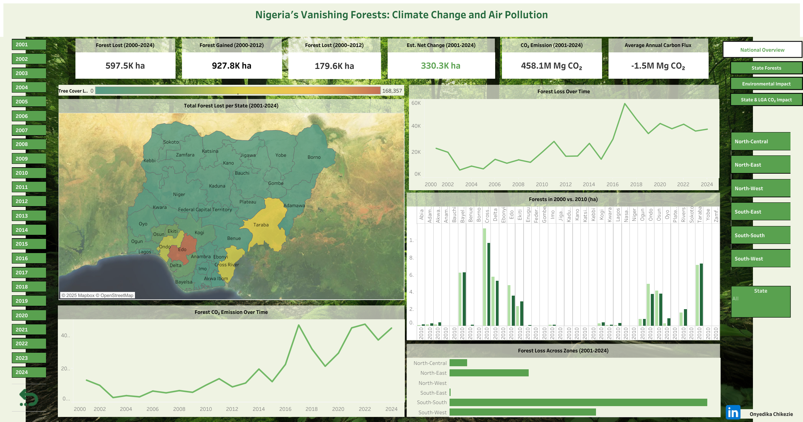
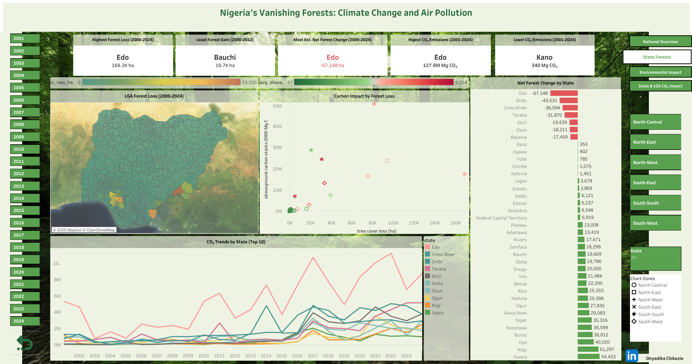
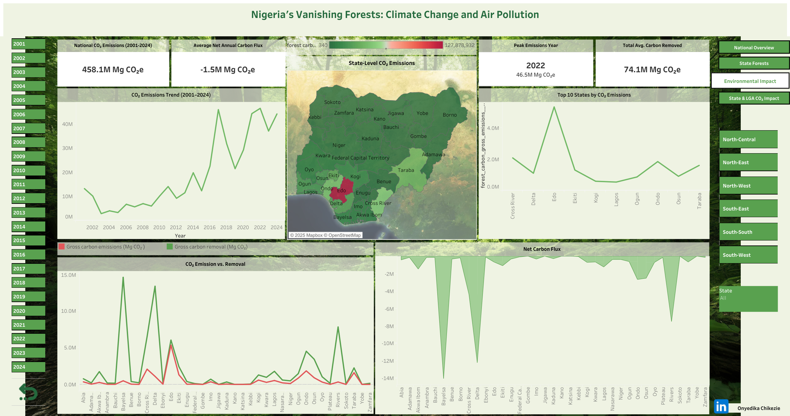
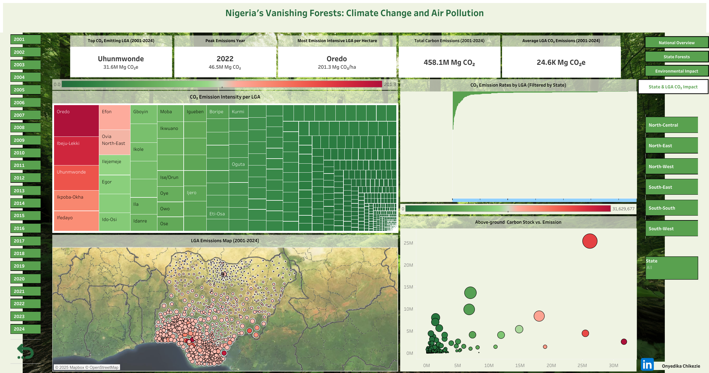

# 🌳 Forest Change in Nigeria (2000–2024)

## Introduction

This analysis is aimed at assessing how Nigeria’s forest landscape has changed between 2000 and 2024, and evaluating the environmental impact of
these changes, particularly in terms of deforestation, afforestation, and associated carbon emissions, at both state and local government levels.

---

## 🔍 Project Objectives

The aim of this project is to provide answers to the following questions:

1. How has Nigeria’s total forest cover changed annually from 2000 to 2024?

2. Which states in Nigeria experienced the highest cumulative forest loss between 2000 and 2024?

3. Which states recorded the least forest gain between 2000 and 2012?

4. How did forest extent change between 2000 and 2010 across Nigerian states? 

5. What are the trends in CO₂ emissions from forest loss across Nigeria from 2001 to 2024?

6. Which states emitted the most CO₂ due to forest loss during the study period?

7. How is forest loss spatially distributed across Nigeria’s states and LGAs? 

8. What is the net carbon flux (emissions vs removals) from forests in each state?

9. How does above-ground carbon stock correlate with forest loss or CO₂ emissions?

10. How do trends in forest loss vary by geopolitical zones in Nigeria?

---

## 🧰️ Tools Used

* **Excel** for data transformation

* **Tableau Public** for visualisation

* **GitHub** for documentation

---

## 📝 Data Overview

**Data Source**: [Global Forest Watch](https://www.globalforestwatch.org/dashboards/country/NGA/)

The tree cover data was produced by the University of Maryland's GLAD laboratory in partnership with Google (Hansen et al. 2013).

*Original excel file has 7 sheets:*

1.	Read_Me: General Information on the dataset

2.	Country tree cover loss: Hectares of tree cover loss at a national level, between 2001-2024, categorized by percent canopy cover in 2000.

3.	Country carbon data: Aboveground woody biomass stocks and densities in 2000 (Mg above ground biomass(AGB) and Mg AGB/ha, respectively); average annual green house gas emissions, removals (sequestration), and net flux between 2001 and 2024 (Mg CO2e/yr); annual green house gas emissions (Mg CO2e). Provided by percent canopy cover in 2000 (>30%, 50%, and 75% only).

4.	Subnational 1 tree cover loss: Hectares of tree cover loss at the first sub-national (State) level, between 2001-2024, categorized by percent canopy cover in 2000.

5.	Subnational 1 carbon data: Amounts of Carbon dioxide released into the atmosphere at the first sub-national (State) level, between 2001-2024.

6.	Subnational 2 tree cover loss: Hectares of tree cover loss at the second sub-national (Local Government Area) level, between 2001-2024, categorized by percent canopy cover in 2000.

7.	Subnational 2 carbon data: Amounts of Carbon dioxide released into the atmosphere at the second sub-national (LGA) level, between 2001-2024.

*Column names across tables and what they represent:*

1.	Country: The country where the data was collected.

2.	Subnational1: The state within the country.

3.	Subnational2: The LGA where data was collected.

4.	Threshold: The tree canopy density threshold (%), e.g., 10%, 30%, or 50%. It defines what is considered "tree cover" in your dataset. For example, if threshold = 30, then only areas with ≥30% canopy cover are included.

5.	area_ha: The total area (in hectares) covered by region (e.g., a state or LGA). It could be the total land area or area analysed.

6.	extent_2000_ha: The tree cover extent in the year 2000, in hectares, using the defined threshold.

7.	extent_2010_ha: The tree cover extent in 2010, in hectares, using the same threshold.

8.	gain_2000-2012_ha:	Total tree cover gain (forest regeneration or afforestation) from 2000 to 2012, in hectares.

9.	tc_loss_ha_2001 to tc_loss_ha_2024: These are annual tree cover loss values (in hectares) for each year from 2001 to 2024. "tc" = Tree Cover.

10.	umd_tree_cover_density_2000__threshold: The minimum percentage of tree canopy cover used to define what counts as “tree cover” in the year 2000, based on data from the University of Maryland.

11.	umd_tree_cover_extent_2000__ha: Same as `extent_2000_ha`.

12.	gfw_aboveground_carbon_stocks_2000__Mg_C: The total amount of carbon stored in above-ground vegetation (like trees and plants) in 2000, measured in megagrams of carbon (Mg C), which is the same as metric tonnes of carbon.

13.	avg_gfw_aboveground_carbon_stocks_2000__Mg_C_ha-1: The average amount of aboveground carbon per hectare in 2000.

14.	gfw_forest_carbon_gross_emissions__Mg_CO₂e_yr-1: The estimated average annual amount of carbon dioxide equivalent (CO₂e) released into the atmosphere from forest loss, averaged across all years, measured in megagrams per year.

15.	gfw_forest_carbon_gross_removals__Mg_CO₂_yr-1: The estimated average annual amount of carbon dioxide absorbed by forest regrowth (carbon removal through photosynthesis), also in megagrams per year.

16.	gfw_forest_carbon_net_flux__Mg_CO₂e_yr-1: The net effect (emissions minus removals) of carbon flux in forest areas. If positive, more emissions are happening than removals; if negative, more carbon is being absorbed than released.

17.	The next group of columns tracks annual gross carbon emissions from forest loss, year by year:
gfw_forest_carbon_gross_emissions_2001__Mg_CO₂e to gfw_forest_carbon_gross_emissions_2024__Mg_CO₂e: Each of these shows the amount of carbon dioxide equivalent released in that specific year due to tree cover loss (deforestation or degradation), measured in megagrams (tonnes).

---

## ✏️ Data Transformation Using Excel

**In Excel**

* Extracted and grouped data into 2 new tables; each containing data for both tree cover loss and CO₂ emission at different sub-national levels respectively.

* Checked for and removed duplicates

* Renamed columns

* Filtered data to show only data for dense forests only (where threshold ≥50%) as shown by Estoque et al., 2021

**In Power Query**

* Grouped data

* Renamed Columns

* Aggregated data

* Broke data into 4 smaller tables in a different workbook; one for tree cover loss and one for CO₂ emission at state and LGA levels respectively

* Unpivoted data across years to merge them into 2 columns - one for the year, one for the value (2001-2024)

* Broke data further into 6 smaller tables: one for metadata, one for tree cover loss and one for CO₂ emissions at state and LGA levels respectively.

* Copied tables into a different workbook and saved them as new tables

* Introduced a new table for geo-political regions

---

## 📉 Visualisation Using Tableau Public

* Imported data from excel workbook

* Created logical tables on tableau public to show relationship between tables

* Generated KPI cards and charts on separate sheets

* Grouped KPI cards and charts into 4 dashboards

* Applied table calculations for trendlines, rankings, and net change metrics.

### 📊 Dashboards Overview

**1. National Overview**

- KPIs show cumulative forest loss and gain.

- Annual trend line shows steady increase in forest loss from 2000 to 2024.

- CO₂ emissions mirror the trend in forest cover decline.

**2. State & LGA Forest Change**

- Visualises state-level net forest change and rank.

- Identifies states with the most volatile forest dynamics.

- Maps forest loss distribution at the LGA level using interactive filters.

**3. Environmental Impact**

- Compares forest carbon emissions vs removals across states

- Highlights net carbon flux per state to identify emitters vs sinks.

- Tracks CO₂ emission across years.

**4. CO₂ Impact by State & LGA**

- Shows LGAs ranked by total CO₂ emissions.

- Visualises spatial emissions hotspots at the LGA level.

- Forest size (extent) , above-ground carbon stock and CO₂ emissions visualised together to show carbon balance.

## 📈 Key Insights

1. Nigeria has experienced a fluctuating pattern of forest loss between 2000 and 2024; recording the least tree cover area loss in 2003 with 5,995 ha and peaking at 57,198 ha in 2017 and maintaining a steady pattern from 2019-2024.

2. **Edo state** had the highest cumulative forest loss between 2000 and 2024 with 168,357ha of tree cover loss. It is followed by **Taraba** with a loss of 93,652ha, **Cross River** with a loss of 81,186ha and **Ondo** with a loss of 75,026ha.

3. **Bauchi** had the least tree cover gain recorded between 2000 and 2012 with a 19.669ha tree cover loss.

4. States like **Rivers**, **Ekiti**, **Plateau**, and **Akwaibom** had more dense forests in 2010 than in 2000; states like **Cross River**, **Delta**, **Edo** and **Ondo** had less dense forests in 2010 than in 2000; while states like **Bayelsa** and **Kastina** had little to no difference.

5. CO₂ emission patterns accross the years (2001-2024) closely mirrored forest cover loss during same period, peaking at 46 million MgCO₂ in 2017 and then again in 2022 at 46.5 million MgCO₂.

6. **Edo state** recorded the highest CO₂ emission from 2001-2024. Other States with  high CO₂ emissions during this period include Cross River, Ondo, Taraba, Ekiti, Delta, Osun,Ogun, Kogi and Lagos.

7. LGAs in **Edo**, **Cross River**, **Ondo** and **Taraba** were shown to have the most significant forest cover losses. Cumulatively, **Edo**, **Taraba** , **Cross River** and **Ondo** were shown to lose the most forest cover. Northern States and their LGAs showed the least loss of forest covers.

8. Net forest carbon flux is negative across all states and  notably least in **Bayelsa, Delta** and to an extent, **Rivers** as well. This shows that the dense forests in these states remove higher levels of CO₂ than they emit.

9. Above-ground carbon stock rise and fall is independent on CO₂ emission levels.

10. The highest occurence of deforestation are observed in the South-South and South-West regions while the least occurence are observed in the North-West and South-East regions of the country.

---

## Recommendations

Based on findings from this analysis, there is a pressing need for targeted forest conservation efforts to combat the alarming trends of deforestation and rising CO₂ emissions observed across Nigeria between 2000 and 2024. Stricter enforcement of environmental laws, expanded protected areas, and improved satellite-based forest monitoring should be prioritised in states such as Edo, Taraba, Cross River, and Ondo, which account for the highest cumulative forest loss and emissions. Also, states with high carbon stock but lower deforestation levels like Delta and Bayelsa, should lead large-scale afforestation and forest restoration programmes to preserve their function as critical carbon sinks.

To ensure lasting outcomes, these interventions must be decentralised and community-driven. LGAs experiencing rapid deforestation should be empowered with resources and environmental monitoring tools. Allocating environmental grants and carbon credits based on performance metrics like afforestation rates or emission reduction will be beneficial.

Integrating local-level data into national policy frameworks can improve transparency and responsiveness. Public dashboards, like the one built in this project, can be institutionalised to track state and LGA performance on forest and carbon metrics.

Fostering collaboration between sectors is essential; aligning forest, agricultural, urban development, and climate policies will help address the root causes of forest degradation.

Future research should focus on the ecological and socioeconomic drivers of tree cover loss and carbon flux variations across states and geopolitical zones. Public education, ecosystem service incentives, and youth-led conservation programmes can yield long-term results. By integrating data-driven governance, local engagement, and national climate priorities, Nigeria can transition towards a more resilient, low-carbon future while protecting its vital forest resources.

---

### 📊 For more insights

Access and interact with the dashboards on [Tableau Public](https://public.tableau.com/views/ForestChangeinNigeria2000-2024/NationalOverview)

---

**References**

Estoque, R.C., Johnson, B.A., Gao, Y., DasGupta, R., Ooba, M., Togawa, T., Hijioka, Y., Murayama, Y., Gavina, L.D., Lasco, R.D. and Nakamura, S., (2021). Remotely sensed tree canopy cover-based indicators for monitoring global sustainability and environmental initiatives. Environmental Research Letters, 16(4), p.044047.

Global Forest Watch <https://www.globalforestwatch.org/dashboards/country/NGA/>

Hansen, M.C., Potapov, P.V., Moore, R., Hancher, M., Turubanova, S.A., Tyukavina, A., Thau, D., Stehman, S.V., Goetz, S.J., Loveland, T.R. and Kommareddy, A., 2013. High-resolution global maps of 21st-century forest cover change. science, 342(6160), pp.850-853.

---

**Project Files**
* `README.md` - Project overview and documentation
* `NGA.xlsx` - Excel file from Global Forest Watch containing original data
* `NigeriaForestsDataCleaned-12-7-2025.xlsx` - Excel workbook with clean and organised data
* `national_overview.png` - Dashboard 1: National overview of forest gain and loss
* `state_forests_dashboard.png` - Dashboard 2: State level breakdown of forest loss and gain
* `environmental_impact_dasboard.png` - Dashboard 3: State level breakdown of co₂ emission and removal
* `state_&_lga_co₂_impact.png` - Dashboard 4: LGA level observation of co₂ emission and removal

---

### ✍️ Author

**Onyedika Chikezie**

*Health and Environmental Data Analyst*

Feel free to reach out on [LinkedIn](https://www.linkedin.com/in/onyedika-chikezie-55978a21a) or send an email to <chikeziesly@gmail.com>.
